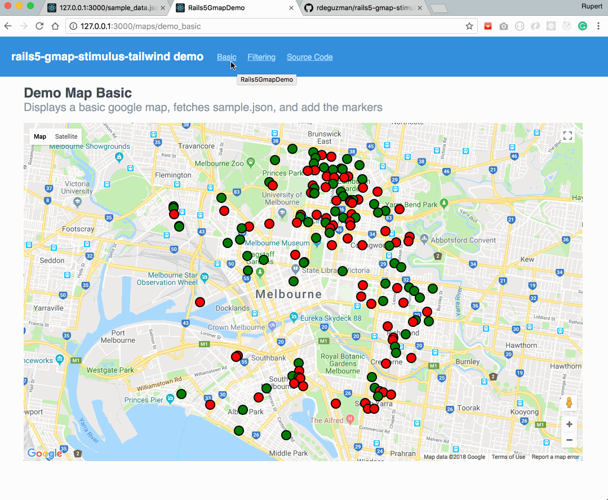

# README

Below is a simple demo using rails5 + webpacker + stimulus + google maps.

## Install

Install webpacker + stimulusjs

```
# rails new rails5-gmap-demo --database=postgresql --skip-sprockets --skip-bundle --skip-coffee --skip-test --webpack
# cd rails5-gmap-demo
# yarn add stimulus
# gem install -V bundler --no-ri --no-rdoc
# bundle install
# yarn install
```

## Setup database
```
# bundle exec rake db:create
# bundle exec rake db:migrate
```

## Run rails server
```
# bundle exec rails s -b 0.0.0.0 -e development -p 3000
```
And browse http://127.0.0.1:3000/maps/demo_filtering


